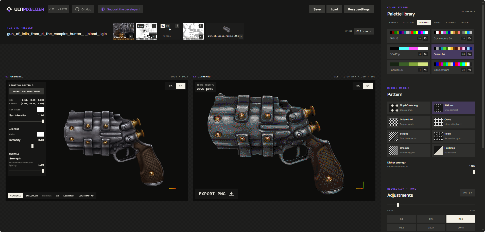

On the surface, UltiPixelizer is an easy-to-use dithering tool for textures. But feed it a 3D model and you can bake lighting and ambient occlusion, which, combined with a normal map and a base color, achieve a retro PS1-esque aesthetic. Every file is processed locally in your browser; nothing is uploaded.

## Features

- **Image + model input**: drop a PNG/JPG/WebP/GIF texture, or a 3D model bundle (FBX, OBJ, glTF/GLB, USDZ plus companion textures).
- **Pixelation**: target resolution from 24 to 512 px.
- **Dithering**: Floyd-Steinberg, Atkinson, Ordered 4×4, Cross, Stripes, Noise, Checker, and Hard map (no diffusion).
- **Palettes**: 30 built-in presets plus a custom palette editor with import/export.
- **Adjustments**: brightness, contrast, and saturation.
- **3D preview**: orbit the model with baked lighting applied; select UV channel, LOD level, and world axis (Blender Z-up / Maya Y-up).
- **Baking**: generate ambient occlusion, bake lighting into UV space, and apply normal maps.
- **UV overlap visualization**: an animated screen-space glow wave highlights overlapping UV shells.
- **Export**: save the dithered result as a PNG, and save/load settings as JSON.

## Usage

Open the live app at [ultikynnys.github.io/UltiPixelizer](https://ultikynnys.github.io/UltiPixelizer/).

## Desktop app

UltiPixelizer also ships as a standalone desktop app for Windows and Linux via [Tauri 2](https://v2.tauri.app/) — a few megabytes instead of a whole browser, using the OS webview. The `Build desktop apps` workflow packages it on every push to `main` (installers land as workflow artifacts) and publishes a GitHub Release when you push a `v*` tag.

To build locally you need [Rust](https://rustup.rs/) and the [Tauri system dependencies](https://v2.tauri.app/start/prerequisites/):

```sh
npm install
npm run tauri dev      # run against the Vite dev server
npm run tauri build    # production bundles in src-tauri/target/release/bundle/
```

All processing stays local either way. One caveat: the UI fonts load from Google Fonts, so the desktop app needs a network connection for the custom typography — offline it falls back to system fonts.

Installer versions track the in-app build badge: both derive from the same git build count, with the count split into three digits for semver (`v124` in the badge → installer `1.2.4`).

## License

[MIT](LICENSE)

## Support

If you find UltiPixelizer useful, consider supporting the developer on [Ko-fi](https://ko-fi.com/r60dr60d).
