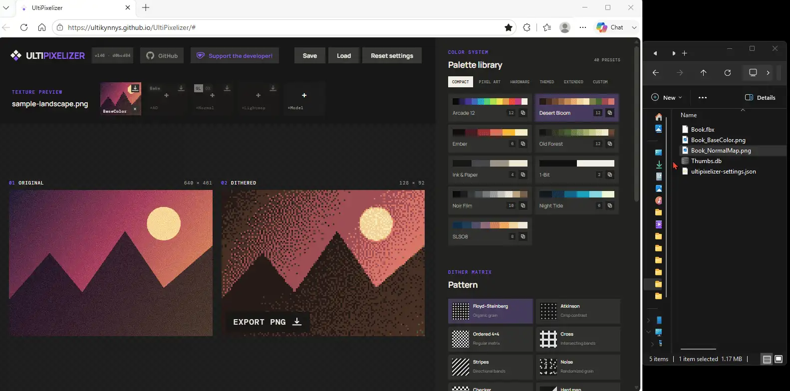
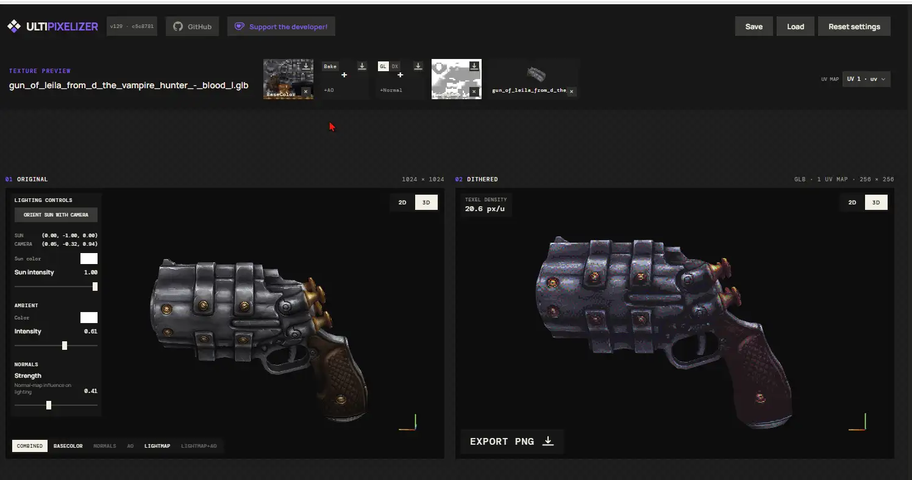
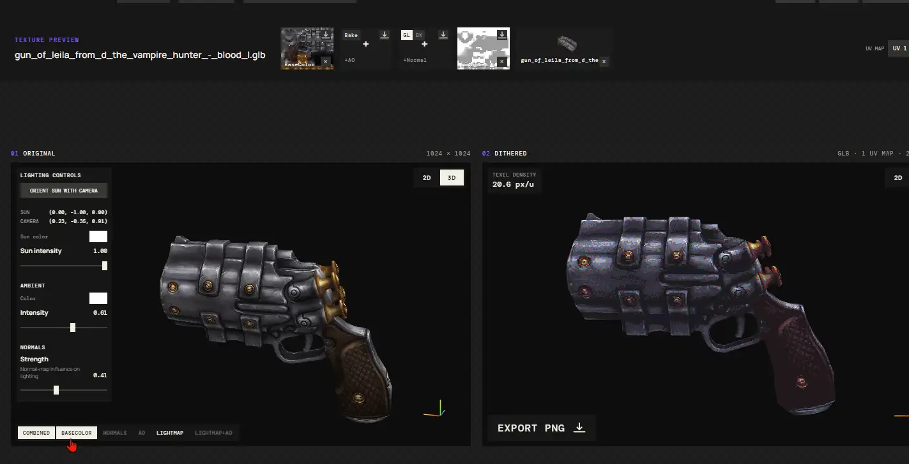
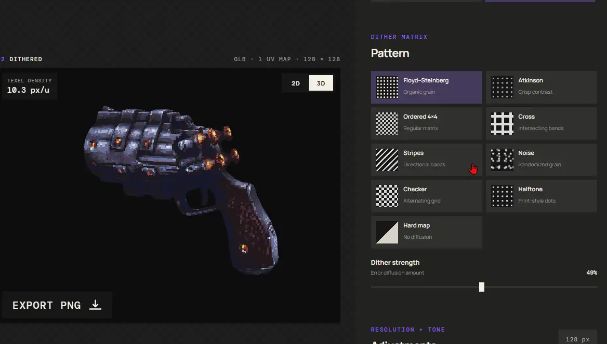
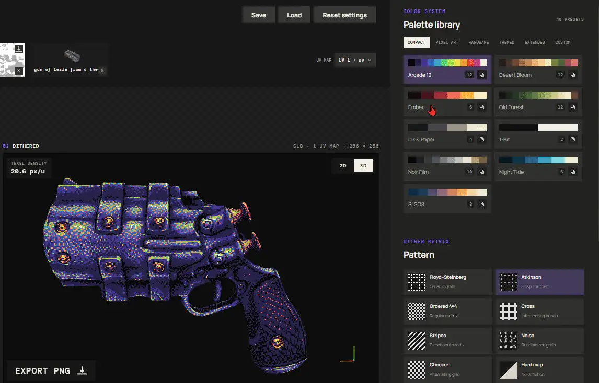
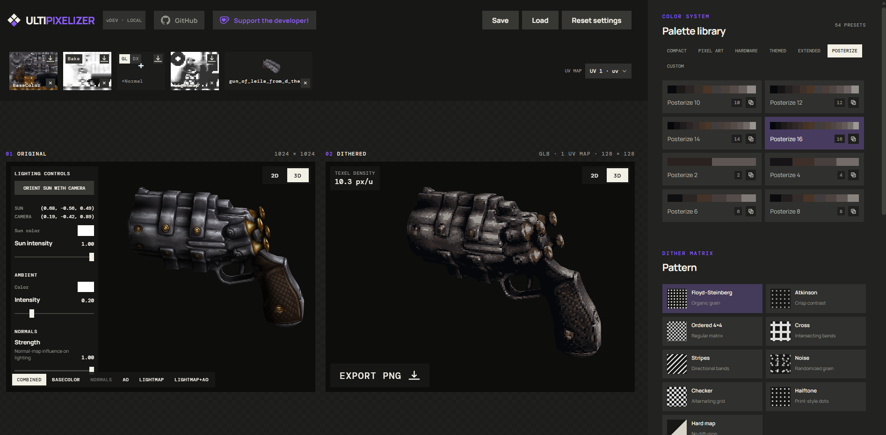
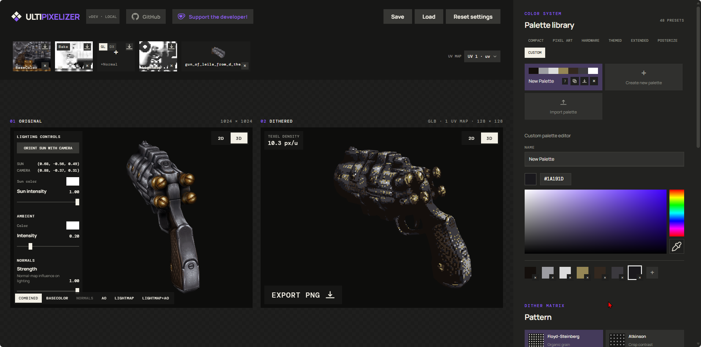

On the surface, UltiPixelizer is an easy-to-use dithering tool for textures. But feed it a 3D model and you can bake lighting and ambient occlusion, which, combined with a normal map and a base color, achieve a retro PS1-esque aesthetic. Every file is processed locally in your browser; nothing is uploaded.

## Demo

Drag and drop a texture or a 3D model bundle straight into the window:



## Showcase

Bake ambient occlusion directly in the app and apply it straight to the combined dither result:



Bake lightmaps directly in the app and apply them straight to the combined dither result:



Nine dither methods, from error diffusion to a lighting-driven halftone dot screen:



Comes with 47 built-in palettes:



Posterize ramps adapt their colors to your texture's tones:



Build your own palettes with the custom palette editor, save them in the app, and export any palette to an external file (`.palette.json`). Import palettes back from JSON, hex, or plain-text files:



## Features

- **Image + model input**: drop a PNG/JPG/WebP/GIF texture, or a 3D model bundle (FBX, OBJ, glTF/GLB, USDZ plus companion textures).
- **Pixelation**: target resolution from 24 to 2048 px (2K).
- **Dithering**: Floyd-Steinberg, Atkinson, Ordered 4×4, Halftone, Cross, Stripes, Noise, Checker, and Hard map (no diffusion).
- **Palettes**: 47 built-in palettes — including 8 Posterize ramps (2–16 levels) whose colors are derived live from your BaseColor — plus a custom palette editor with import/export.
- **Adjustments**: brightness, contrast, and saturation.
- **3D preview**: orbit the model with baked lighting applied; select UV channel, LOD level, and world axis (Blender Z-up / Maya Y-up).
- **Baking**: generate ambient occlusion, bake lighting into UV space, and apply normal maps.
- **UV overlap visualization**: an animated screen-space glow wave highlights overlapping UV shells.
- **Export**: save the dithered result as a PNG, and save/load settings as JSON.

## Usage

Open the live app at [ultikynnys.github.io/UltiPixelizer](https://ultikynnys.github.io/UltiPixelizer/).

## Desktop app

UltiPixelizer also ships as a standalone desktop app for Windows and Linux via [Tauri 2](https://v2.tauri.app/) — a few megabytes instead of a whole browser, using the OS webview. The `Build desktop apps` workflow packages every push to `main` and publishes the installers as a GitHub Release, auto-tagging each build with its version (e.g. `v1.2.5`).

To build locally you need [Rust](https://rustup.rs/) and the [Tauri system dependencies](https://v2.tauri.app/start/prerequisites/):

```sh
npm install
npm run tauri dev      # run against the Vite dev server
npm run tauri build    # production bundles in src-tauri/target/release/bundle/
```

All processing stays local either way. One caveat: the UI fonts load from Google Fonts, so the desktop app needs a network connection for the custom typography — offline it falls back to system fonts.

Installer versions track the in-app build badge: both derive from the same git build count, with the count split into three digits for semver (`v124` in the badge → installer `1.2.4`).

## License

[MIT](LICENSE)

## Support

If you find UltiPixelizer useful, consider supporting the developer on Ko-fi:

<a href="https://ko-fi.com/r60dr60d" target="_blank"></a>

## Attributions

3D models used in the demo videos and screenshots:

- ["Needle OC"](https://sketchfab.com/3d-models/needle-oc-2d523b639c79407daff09ed23491e706) by [CataRackta](https://www.artstation.com/catarackta), [CC Attribution](https://creativecommons.org/licenses/by/4.0/)
- ["Gun of Leila from D the Vampire Hunter - Blood L"](https://sketchfab.com/3d-models/gun-of-leila-from-d-the-vampire-hunter-blood-l-3RXKSlKHlIhV8Cjs1DqRq3mQheN) by Csaba Baity (tsabszy), [CC Attribution](https://creativecommons.org/licenses/by/4.0/)
